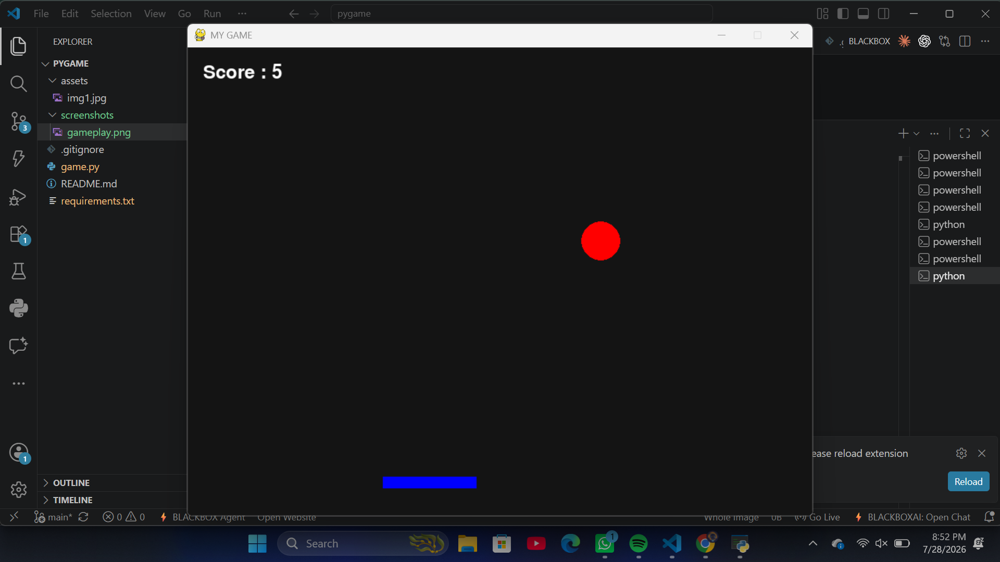
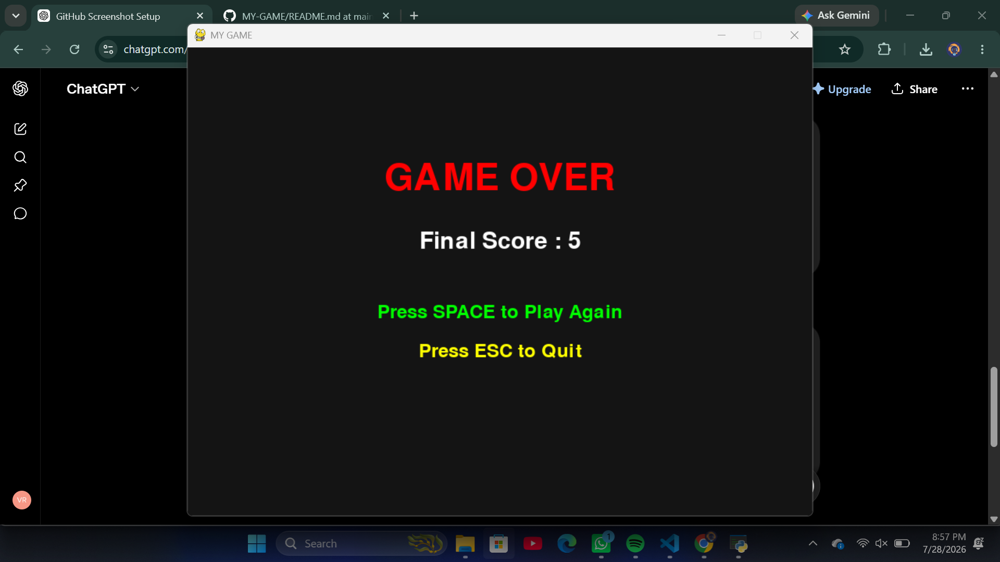

# 🎮 GameXK

A simple and fun **Ball Catching Arcade Game** built using **Python** and **Pygame**.

Control the paddle, catch the falling ball, and achieve the highest score. The game now includes a **persistent high score system**, so your best score is saved even after closing the game.

---

## ✨ Features

- 🎯 Catch the falling red ball
- 🎮 Smooth paddle movement
- 📈 Live score tracking
- 🏆 Persistent High Score (saved automatically)
- 💀 Game Over screen
- 🔄 Restart game using the **SPACE** key
- ❌ Quit game using the **ESC** key
- ⚡ Simple and beginner-friendly gameplay
- 🧑‍💻 Great project for learning Python and Pygame

---

## 🛠️ Technologies Used

- 🐍 Python 3
- 🎮 Pygame

---

## 🎮 Controls

| Key | Action |
|------|--------|
| ⬅ Left Arrow | Move Paddle Left |
| ➡ Right Arrow | Move Paddle Right |
| SPACE | Play Again |
| ESC | Quit Game |

---

## 🚀 Installation

### 1️⃣ Clone the Repository

```bash
git clone https://github.com/kirankumarreddy333/MY-GAME.git
```

### 2️⃣ Navigate to the Project Folder

```bash
cd MY-GAME
```

### 3️⃣ Install Dependencies

```bash
pip install -r requirements.txt
```

### 4️⃣ Start the Game

```bash
python game.py
```

---

## 🎯 Gameplay

- Move the blue paddle using the **Left** and **Right** arrow keys.
- Catch the falling red ball before it reaches the bottom.
- Every successful catch increases your score.
- Missing the ball ends the game.
- Beat your **Highest Score**, which is saved automatically for future sessions.

---

## 📂 Project Structure

```text
MY-GAME/
│
├── screenshots/
│   ├── gameplay.png
│   └── game-over.png
│
├── game.py
├── highscore.txt
├── requirements.txt
├── README.md
└── .gitignore
```

---

## 📸 Screenshots

### 🎮 Gameplay



### 💀 Game Over



---

## 🏆 High Score System

The game automatically stores your highest score in:

```text
highscore.txt
```

This means your best score remains saved even after closing and reopening the game.

---

## 🔮 Future Improvements

- 🎵 Background Music
- 🔊 Sound Effects
- ❤️ Multiple Lives
- ⚡ Dynamic Difficulty
- 🪙 Coins & Power-ups
- 🌟 Particle Effects
- 📊 Levels and Achievements
- 🎨 Better Graphics & Animations

---

## 👨‍💻 Author

**Velicharla Kiran Kumar Reddy**

- GitHub: https://github.com/kirankumarreddy333

---

## ⭐ Support

If you enjoyed this project, please consider giving it a **⭐ Star** on GitHub.

It helps others discover the project and motivates future improvements!
