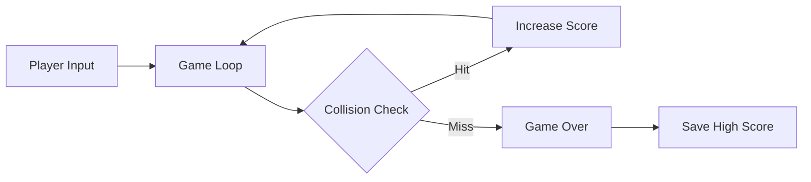

# 🎮 GameXK

«Catch. Score. Repeat. Conquer.»

## ✨ Overview

A simple and fun **Ball Catching Arcade Game** built using **Python** and **Pygame**.

This project was created to demonstrate fundamental game development mechanics, event handling, and game loop management using Pygame. It serves as an excellent starting point for understanding interactive graphics programming in Python.

## 🎯 Problem Statement

Learning game development can be daunting. Beginners often struggle with complex game engines and heavy abstractions. There is a need for simple, understandable, and well-structured codebases that teach the fundamentals of game loops, collision detection, and state management.

## 💡 Solution

GameXK provides a clean, minimalistic Pygame implementation that covers essential mechanics: player input, entity movement, boundary collision, scoring, and persistent data storage.

## 🚀 Key Features

- ⚡ **Real-Time Input Handling**: Smooth paddle movement using keyboard events.
- 🤖 **Physics & Collision**: Accurate bounding-box collision detection between the paddle and falling entities.
- 📊 **Dynamic Scoring**: Live score tracking and automated high-score persistence using file I/O.
- 🔐 **State Management**: Robust game states transitioning seamlessly from active gameplay to game-over screens.

## 🧠 How It Works



## 🛠️ Tech Stack

| Category | Technology |
|---|---|
| Language | Python 3 |
| Graphics | Pygame |
| Storage | Local File System (txt) |

## 📂 Project Structure

- `game.py`: Main application script and game loop logic.
- `requirements.txt`: Python dependency configuration.
- `.gitignore`: Ignored files and security configurations.
- `screenshots/`: Visual assets for documentation.

## ⚙️ Installation

```bash
git clone https://github.com/kirankumarreddy333/MY-GAME.git
cd MY-GAME
pip install -r requirements.txt
```

## 🔑 Environment Variables

*No sensitive environment variables are required for this project.*

«Never commit ".env" files or real credentials to GitHub.»

## ▶️ Running the Project

```bash
python game.py
```

## 📸 Screenshots / Demo

### 🎮 Gameplay


### 💀 Game Over


## 🔒 Security

- Secrets and credentials must never be committed to the repository.
- A robust `.gitignore` is in place to prevent accidental exposure of `.env` files, private keys, or build artifacts.

## 🔮 Future Improvements

- 🎵 Audio integration (background music and sound effects)
- ❤️ Multiple lives system
- ⚡ Dynamic difficulty scaling
- 🪙 Collectible power-ups and debuffs

## 🤝 Contributing

Contributions, issues, and feature requests are welcome! Feel free to check the issues page.

## 👨‍💻 Author

**Kiran Velicharla**
- GitHub: [@kirankumarreddy333](https://github.com/kirankumarreddy333)

## 📜 License

This project is licensed under the MIT License.

See the [LICENSE](LICENSE) file for details.
